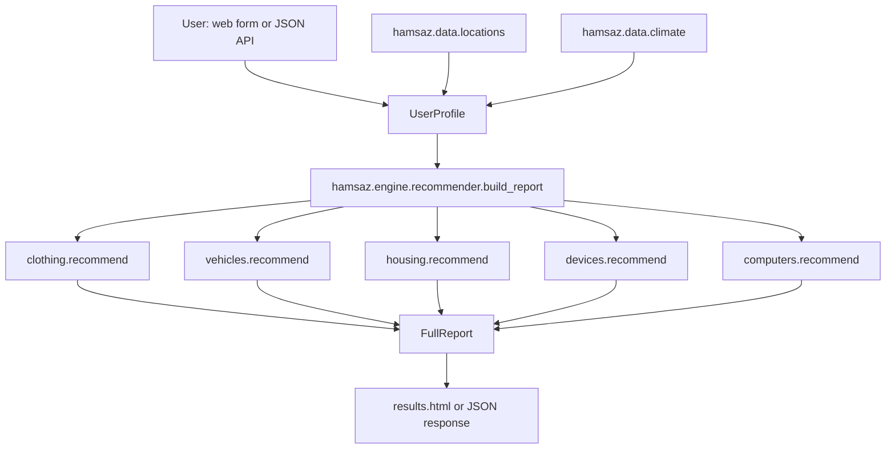

# Hamsaz — A Location-Aware Buying Advisor

**Hamsaz** (Persian: هم‌ساز, "in harmony with / well-matched") is a rule-based
advisory engine that answers one practical question in five different ways:

> *"Given where I live and how much I can spend, what should I actually buy?"*

It generates structured, opinionated recommendations across **clothing,
vehicles, housing, digital devices, and computer systems**, driven by real
climate science, financial capacity, and location-specific risk factors —
not generic listicle advice.

This is a full-stack Python project: a dependency-free recommendation
engine, a Flask web application with a hand-built (non-templated-looking)
UI, a small JSON API, and a real test suite.

---

## Why this isn't a throwaway project

- **A real knowledge base, not a stub.** 11 climate zones (simplified
  Köppen classification) and 80 curated world cities (including 14 Iranian
  cities), each with cost-of-living index, coastal exposure, storm risk,
  seismic risk, air quality, and electrical grid reliability.
- **A genuine rules engine.** Five independent recommendation modules
  (`clothing`, `vehicles`, `housing`, `devices`, `computers`) each encode
  real, climate-specific and budget-specific advice — not a single
  generic template with variables swapped in.
- **Cross-cutting factors that actually change the advice**, not just
  flavor text: earthquake risk changes structural housing advice, storm
  risk changes insurance and vehicle advice, unreliable power grids change
  whether we recommend a laptop or a desktop, poor air quality adds mask
  and air-purifier guidance, coastal exposure adds corrosion-proofing advice.
- **A real test suite** (35 tests) covering the engine's business logic,
  every climate zone, every budget tier, every computer use case, and the
  Flask routes/forms/API — run with `pytest`.
- **A deliberately custom UI**, not a generic Bootstrap/Tailwind template —
  see the [Design notes](#design-notes) section.
- **A working JSON API** (`POST /api/recommend`), so the engine isn't
  locked to the HTML form.

---

## Quick start

Requires Python 3.9+ (developed and tested on Python 3.14).

```bash
cd hamsaz-advisor
python -m venv .venv
# Windows:
.venv\Scripts\activate
# macOS/Linux:
source .venv/bin/activate

pip install -r requirements.txt
python app.py
```

Then open **http://127.0.0.1:5000/** in your browser.

To run the test suite:

```bash
pip install pytest
pytest -v
```

All 35 tests should pass in under a few seconds.

---

## How it works

1. **Pick a location.** Choose from 80 curated cities (searchable), or
   describe your own location manually (climate zone, cost of living, air
   quality, grid reliability, coastal/storm/seismic flags).
2. **Pick a financial comfort level.** One of four tiers — *Budget*,
   *Balanced*, *Comfortable*, *Premium* — that scales every recommendation.
3. **Pick a computer use case.** One of eight profiles (general, office,
   student, gaming, creative, programming, data science, engineering) that
   drives the detailed computer-buying section.
4. **Optionally describe your household** (size, children) — this
   sharpens the housing and vehicle advice.
5. **Get a five-part report**, each with a summary, a "recommended" list,
   an "avoid" list, and contextual notes/tips specific to your inputs.

### Example: what actually changes the advice

| Input | Effect |
|---|---|
| Climate = Subarctic | Arctic-rated parka, block-heater-compatible car battery, cold-weather laptop condensation warning |
| Seismic risk = true | Reinforced-frame housing advice, avoid unreinforced masonry, structural retrofit priority |
| Storm risk = true | Storm shutters/impact windows, flood insurance note, comprehensive vehicle insurance note |
| Grid reliability = unstable | Laptop over desktop, UPS/voltage-stabilizer recommendations, plug-in hybrid over EV |
| Air quality = poor | N95/KN95 mask note in clothing, HEPA air purifier with CADR sizing in devices |
| Coastal = true | Rust-proofing/undercoating for cars, marine-grade hardware for housing, corrosion notes for devices |
| Budget = Premium vs Budget | Different tone and options across all five categories — new vs. used cars, custom-build vs. rental housing, tailored outerwear vs. secondhand basics |

---

## Architecture



The recommendation engine (`hamsaz/`) has **zero dependency on Flask or any
web framework** — it's plain Python dataclasses and functions. `app.py` is
a thin Flask layer on top of it. This means the engine can be reused from a
CLI script, a different web framework, or a Jupyter notebook without any
changes.

### Project structure

```
hamsaz-advisor/
├── app.py                     # Flask routes, form parsing, JSON API
├── requirements.txt
├── hamsaz/                    # Pure-Python engine (no Flask dependency)
│   ├── data/
│   │   ├── climate.py         # 11 climate zone definitions
│   │   ├── locations.py       # 80 curated cities with risk/COL data
│   │   └── budget.py          # Budget tier & use-case display metadata
│   └── engine/
│       ├── models.py          # UserProfile, Recommendation, FullReport
│       ├── clothing.py        # Clothing rules engine
│       ├── vehicles.py        # Vehicle rules engine
│       ├── housing.py         # Housing rules engine
│       ├── devices.py         # Digital device / appliance rules engine
│       ├── computers.py       # Computer-buying rules engine
│       └── recommender.py     # Orchestrates all five engines
├── templates/                 # Jinja2 templates (index, results, 404)
├── static/
│   ├── css/style.css          # Custom "field guide" design system
│   └── js/app.js              # Progressive-enhancement JS (searchable picker)
└── tests/
    ├── test_engine.py         # 23 tests: pure engine logic
    └── test_app.py            # 12 tests: Flask routes, forms, API
```

---

## The JSON API

`POST /api/recommend` accepts a JSON body and returns the full report as JSON.

**Using a known city:**

```bash
curl -X POST http://127.0.0.1:5000/api/recommend \
  -H "Content-Type: application/json" \
  -d '{"location": "tokyo", "budget_tier": "comfortable", "use_case": "gaming"}'
```

**Using a custom location:**

```bash
curl -X POST http://127.0.0.1:5000/api/recommend \
  -H "Content-Type: application/json" \
  -d '{
        "budget_tier": "balanced",
        "use_case": "programming",
        "climate_key": "cold_semi_arid",
        "location_name": "My City",
        "seismic_risk": true,
        "grid_reliability": "variable"
      }'
```

`GET /api/locations` returns the full list of built-in cities with their
country and climate zone, useful for building your own client.

---

## Data & disclaimers

- **Climate zones** are a simplified, practically-oriented take on the
  Köppen climate classification — 11 zones instead of dozens of
  sub-types, enough to drive genuinely different buying advice without
  pretending to be a meteorological authority.
- **Cost-of-living figures** are indicative, relative approximations
  (New York City ≈ 100) meant only for *comparing* cities inside this app.
  They are **not live data** and should never be used for real financial
  or relocation decisions on their own — especially for cities in
  economies with significant currency volatility (e.g. Iran), where the
  index should be read as a rough, relative signal only.
- **Risk flags** (seismic, storm, air quality, grid reliability) are
  general, well-known characteristics of each city/region, not
  forecasts or guarantees.
- This project is a **decision-support starting point**, not financial,
  safety, structural engineering, or medical advice.

---

## Design notes

The UI deliberately avoids the common "AI-generated web app" look
(centered hero, purple/blue gradients, glassmorphism cards, heavy box
shadows, emoji icons). Instead it borrows from printed field guides and
report dossiers:

- Warm paper tones, a serif typeface for body text, and monospace,
  uppercase, letter-spaced labels for UI chrome (like stamps on a
  document).
- Hairline and double-rule borders instead of drop shadows.
- Numbered sections (01, 02, 03…) instead of icon-and-card grids.
- A left-aligned, asymmetric two-column layout on the form page instead
  of a centered single column.
- No emoji, no stock illustrations, no gradient backgrounds.

The location picker is a small, dependency-free JavaScript enhancement
over a plain `<select>` — the form works correctly even with JavaScript
disabled, since the real `<select>` and radio inputs are always present
and functional.

---

## Extending the project

- **Add a city:** add one row to `_RAW` in `hamsaz/data/locations.py`.
- **Add a climate zone:** add an entry to `CLIMATE_ZONES` in
  `hamsaz/data/climate.py`, then add a matching key to the `_BASE` dict in
  *each* of the five engine modules (`clothing.py`, `vehicles.py`,
  `housing.py`, `devices.py`, `computers.py`). The test
  `test_all_climate_zones_have_engine_coverage` will fail loudly if you
  forget one.
- **Add a computer use case:** add an entry to `USE_CASES` in
  `hamsaz/engine/models.py` and `hamsaz/data/budget.py`, then add a
  matching key to `_USE_CASE_SPECS` in `hamsaz/engine/computers.py`.

## License

No license file is included; treat this as a personal/portfolio project
unless you add one.


# هم‌ساز (Hamsaz) — مشاور خرید بر اساس محل زندگیت 🧭

سلام! 👋
این پروژه یه جواب عملی به یه سوال خیلی رایج می‌ده:

> «با توجه به اینکه کجا زندگی می‌کنم و چقدر بودجه دارم، واقعاً باید چی بخرم؟»

**هم‌ساز** بهت پیشنهاد می‌ده که چی بپوشی، چه ماشینی بخری، چه خونه‌ای مناسبته،
چه وسایل دیجیتالی لازم داری، و اگه می‌خوای کامپیوتر بخری دقیقاً باید دنبال
چه مشخصاتی باشی — همه‌ی این‌ها بر اساس آب‌وهوای شهرت، وضعیت مالی‌ت، و یه سری
ریسک‌های واقعی مثل زلزله‌خیزی، طوفان، آلودگی هوا و قطعی برق.

این یه پروژه‌ی نصفه‌کاره یا تزئینی نیست. یه موتور قانون‌محور واقعی پشتشه، با
دیتابیس ۸۰ شهر دنیا (از جمله ۱۴ تا شهر ایرانی)، ۱۱ منطقه‌ی اقلیمی، و ۳۵ تا
تست که همه‌چیز رو چک می‌کنن.

---

## چرا این یکی فرق داره؟

- **دیتای واقعی، نه یه مشت متن الکی.** ۸۰ شهر دنیا با اطلاعات دقیق درباره‌ی
  هزینه‌ی زندگی، نزدیکی به دریا، ریسک طوفان، ریسک زلزله، کیفیت هوا، و
  قابل‌اعتماد بودن شبکه‌ی برق.
- **منطق واقعی پشت هر پیشنهاد.** برای هر کدوم از ۵ دسته (لباس، ماشین، خونه،
  وسایل دیجیتال، کامپیوتر) یه ماژول جدا با قوانین مخصوص خودش نوشته شده —
  نه یه قالب ثابت که فقط اسم‌ها عوض بشه.
- **فاکتورهایی که واقعاً روی پیشنهاد تاثیر می‌ذارن.** مثلاً اگه شهرت زلزله‌خیز
  باشه (سلام تهران و بقیه‌ی شهرهای ایران 😉)، توصیه‌های خونه کاملاً عوض
  می‌شه و میره سمت سازه‌ی مقاوم و اسکلت بتنی. اگه شبکه‌ی برقت ناپایداره،
  به جای کامپیوتر رومیزی، لپ‌تاپ پیشنهاد می‌ده چون باتری‌ش مثل یه UPS
  طبیعیه.
- **تست واقعی داره.** ۳۵ تا تست پایتون که هم منطق موتور رو چک می‌کنن، هم
  صفحات وب و API رو.
- **طراحی سایت شبیه هزار تا سایت دیگه نیست.** به جای اون ظاهر معمولیِ
  گرادینت بنفش‌آبی و کارت‌های گرد با سایه، یه طراحی الهام‌گرفته از دفترچه‌های
  راهنمای میدانی و گزارش‌های چاپی داره — رنگ کاغذی، فونت سریف، خط‌های نازک،
  و بخش‌های شماره‌گذاری‌شده.

---

## چطور اجراش کنم؟

پایتون ۳٫۹ به بالا لازم داری (خودم روی ۳٫۱۴ تستش کردم).

```bash
cd hamsaz-advisor
python -m venv .venv

# ویندوز:
.venv\Scripts\activate
# مک/لینوکس:
source .venv/bin/activate

pip install -r requirements.txt
python app.py
```

بعد برو تو مرورگرت آدرس **http://127.0.0.1:5000/** رو باز کن.

اگه می‌خوای تست‌ها رو هم اجرا کنی:

```bash
pip install pytest
pytest -v
```

باید همه‌ی ۳۵ تا تست سبز بشن (طبق آخرین اجرا، همینطوره ✅).

---

## چطور کار می‌کنه؟

1. **شهرت رو انتخاب کن.** از بین ۸۰ شهر آماده جستجو کن (تهران، مشهد، اصفهان،
   شیراز، تبریز، اهواز، بندرعباس، رشت و خیلی شهرهای دیگه‌ی ایرانی هم هست)،
   یا اگه شهرت لیست نبود، خودت دستی توضیحش بده.
2. **وضعیت مالی‌ت رو انتخاب کن.** از بین ۴ سطح: تنگ‌دست، متعادل، راحت،
   بدون‌محدودیت. همین یه انتخاب روی هر ۵ دسته‌ی پیشنهاد تاثیر می‌ذاره.
3. **بگو کامپیوتر رو برای چی می‌خوای.** بازی، برنامه‌نویسی، طراحی، دیتا
   ساینس، مهندسی و غیره — این بخش جزئیات پیشنهاد کامپیوتر رو مشخص می‌کنه.
4. **اگه دوست داشتی، درباره‌ی خانواده‌ت هم بگو** (تعداد نفرات، بچه‌دار
   بودن) — این باعث می‌شه پیشنهاد خونه و ماشین دقیق‌تر بشه.
5. **گزارش ۵ بخشی‌ت رو بگیر**، هر بخش با یه خلاصه، لیست «پیشنهاد می‌کنیم»،
   لیست «ازش دوری کن»، و یه سری نکته‌ی مخصوص شرایط خودت.

---

## یه مثال از منطق واقعی پشت پروژه

| ورودی | تاثیرش چیه؟ |
|---|---|
| اقلیم = نیمه‌بیابانی سرد (مثل تهران) | کت زمستونی مناسب سرمای زیر صفر، باتری ماشین مقاوم به سرما، توصیه به داشتن دو تا کمد لباس (تابستونی و زمستونی) |
| ریسک زلزله = بله | اسکلت بتنی و مقاوم‌سازی خونه، پرهیز از سقف سنگین و بنایی غیرمسلح |
| ریسک طوفان = بله | کرکره‌ی ضدطوفان، بیمه‌ی سیل، توصیه به بیمه‌ی کامل ماشین |
| برق ناپایدار = بله | لپ‌تاپ به‌جای کامپیوتر رومیزی، پیشنهاد UPS و تثبیت‌کننده‌ی ولتاژ |
| هوای آلوده = بله | ماسک N95 تو لباس، خریدِ تصفیه‌کننده‌ی هوای HEPA تو وسایل دیجیتال |
| نزدیک دریا = بله | ضدزنگ‌کاری ماشین، قطعات ضدخوردگی برای خونه و وسایل الکترونیکی |
| بودجه‌ی «بدون‌محدودیت» در برابر «تنگ‌دست» | تفاوت واقعی تو کل ۵ دسته — ماشین صفر در برابر دست‌دوم، ساخت خونه‌ی سفارشی در برابر اجاره، لباس فاخر در برابر دست‌دوم باکیفیت |

---

## ساختار پروژه

```
hamsaz-advisor/
├── app.py                     # روت‌های فلسک، پردازش فرم، API جیسون
├── requirements.txt
├── hamsaz/                    # موتور خالص پایتون (بدون وابستگی به فلسک)
│   ├── data/
│   │   ├── climate.py         # تعریف ۱۱ منطقه‌ی اقلیمی
│   │   ├── locations.py       # ۸۰ شهر با اطلاعات ریسک و هزینه‌ی زندگی
│   │   └── budget.py          # متادیتای سطح بودجه و کاربرد کامپیوتر
│   └── engine/
│       ├── models.py          # مدل‌های UserProfile و Recommendation
│       ├── clothing.py        # موتور پیشنهاد لباس
│       ├── vehicles.py        # موتور پیشنهاد ماشین
│       ├── housing.py         # موتور پیشنهاد خونه
│       ├── devices.py         # موتور پیشنهاد وسایل دیجیتال
│       ├── computers.py       # موتور پیشنهاد کامپیوتر
│       └── recommender.py     # هماهنگ‌کننده‌ی هر ۵ موتور
├── templates/                 # قالب‌های Jinja2 (فرم، نتیجه، ۴۰۴)
├── static/
│   ├── css/style.css          # طراحی مخصوص خودمون
│   └── js/app.js              # جاوااسکریپت سبک برای جستجوی شهر
└── tests/
    ├── test_engine.py         # ۲۳ تست برای منطق موتور
    └── test_app.py            # ۱۲ تست برای فلسک، فرم‌ها و API
```

---

## یه API هم داره

اگه بخوای از بیرون به این پروژه وصل بشی، یه API ساده‌ی جیسون هم هست:

```bash
curl -X POST http://127.0.0.1:5000/api/recommend \
  -H "Content-Type: application/json" \
  -d '{"location": "tehran", "budget_tier": "balanced", "use_case": "programming"}'
```

و برای گرفتن لیست کامل شهرهای موجود:

```bash
curl http://127.0.0.1:5000/api/locations
```

---

## چند تا نکته‌ی مهم و صادقانه 🙏

- اعداد «هزینه‌ی زندگی» تو این پروژه **تقریبی و نسبی** هستن (نیویورک تقریباً
  ۱۰۰ در نظر گرفته شده)، فقط برای مقایسه‌ی شهرها با هم داخل همین اپ. این‌ها
  دیتای زنده و آنلاین نیستن، پس لطفاً براساس همین عدد تصمیم مالی جدی نگیر
  — مخصوصاً برای شهرهای ایران که به‌خاطر نوسان شدید ارز، این عدد فقط باید
  به‌عنوان یه سیگنال تقریبی و نسبی خونده بشه، نه یه واقعیت ثابت.
- طبقه‌بندی اقلیمی هم یه نسخه‌ی ساده‌شده از سیستم کوپن هست (۱۱ منطقه به‌جای
  ده‌ها زیرمجموعه‌ی تخصصی) — هدف این بوده که پیشنهادها واقعاً فرق کنن، نه
  اینکه ادعای دقت هواشناسی داشته باشیم.
- این پروژه یه **نقطه‌ی شروع خوب برای تصمیم‌گیریه**، نه توصیه‌ی مالی، ایمنی،
  یا مهندسی رسمی. برای تصمیم‌های بزرگ (خرید خونه، ماشین و…) حتماً با
  متخصص واقعی هم مشورت کن.

---

## اگه خواستی خودت بهش چیزی اضافه کنی

- **اضافه کردن یه شهر جدید:** فقط یه خط به لیست `_RAW` تو فایل
  `hamsaz/data/locations.py` اضافه کن.
- **اضافه کردن یه اقلیم جدید:** یه ورودی به `CLIMATE_ZONES` تو
  `hamsaz/data/climate.py` اضافه کن، بعد همون کلید رو تو دیکشنری `_BASE`
  هر ۵ تا فایل موتور (`clothing.py`, `vehicles.py`, `housing.py`,
  `devices.py`, `computers.py`) هم اضافه کن. اگه یادت بره، تست
  `test_all_climate_zones_have_engine_coverage` بهت گیر می‌ده و می‌فهمی
  🙂.
- **اضافه کردن یه کاربرد جدید برای کامپیوتر:** به `USE_CASES` تو
  `hamsaz/engine/models.py` و `hamsaz/data/budget.py` اضافه کن، بعد یه
  ورودی متناظر تو `_USE_CASE_SPECS` داخل `hamsaz/engine/computers.py`
  بساز.

امیدوارم به کارت بیاد! هر سوالی داشتی، کد رو بخون — سعی کردم واضح و بدون
پیچیدگی الکی بنویسمش.
